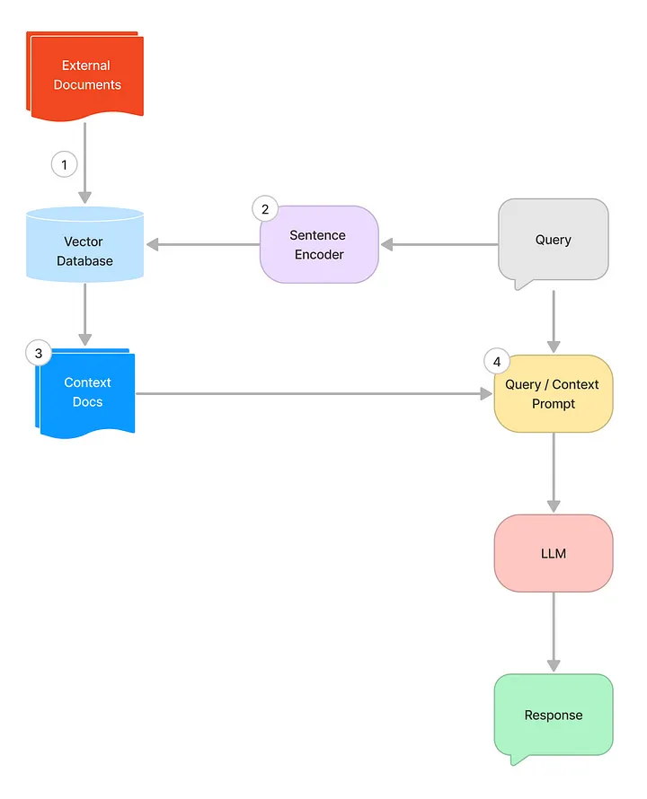

# RAG Demo

## Align expectations
1. I am by no means an expert, my only "claim-to-fame" is I implemented this in my company before.
1. I definitely know less about the context than all of you do as you have been working on this for far longer than I have.
1. Please feel free to question and critique any choices / things you find that don't make sense. In my experience, intuition is a powerful tool, so if something "feels off", please say so.
1. Goals:
    1. Everyone leaves with a rudimentary understanding of RAG, what I like to call in my company, "knowing enough to be dangerous".
    1. Empower everyone with an idea of how to work with LLMs
    1. Do we have to start from scratch with LLM or is it possible to work with existing ones?

## Core Requirements
1. Most of the data is in PDF form, with newer ones being digitised and machine-readable, and older ones likely being scanned in, and thus will need to be OCRed first.
2. The documents live in Sharepoint
3. Due to data controls, no data / documents can leave corporate network (this excludes using ChatGPT or any other online hosted tools out there)
4. Initial version can be simple, just to answer queries, and based on only the data and documents the user has access to. This can be extended later on to add in the authorisation controls and answering for people who don't have access to certain documents.
1. Personalised ChatGPT for the department

## Suggested system implementation as foundation
1. Retrieval-Augmented Generation instead of fine-tuning
    1. Reasons:
        1. Less GPU and time-intensive training requirements
        1. Able to iterate quicker
        1. No need to finetune as providing context is enough to prompt the LLM to return the right value
    1. How does it work?
        1. On every query, instead of directly passing the query to the LLM, the query is intercepted and sent through a retrieval step.
        1. Retrieval will search a vector database and retrieve relevant context using a form of similarity score
        1. Query will be sent to LLM with the context bundled together.
    
    1. Tech stack:
        1. Ollama for local model
        1. Streamlit for UI
        1. Langchain for llm chaining and helpers
        1. Model: LLama2

1. `llamaindex` vs `langchain`
    1. llamaindex is more highlevel, langchain is more low-level.
1. Demo

## Further work
1. Integrate Sharepoint
1. Augment document data with user access controls
1. Evaluate Chroma, QDrant etc vs FAISS
1. Evaluate if Mixtral would work better due to MoE architecture